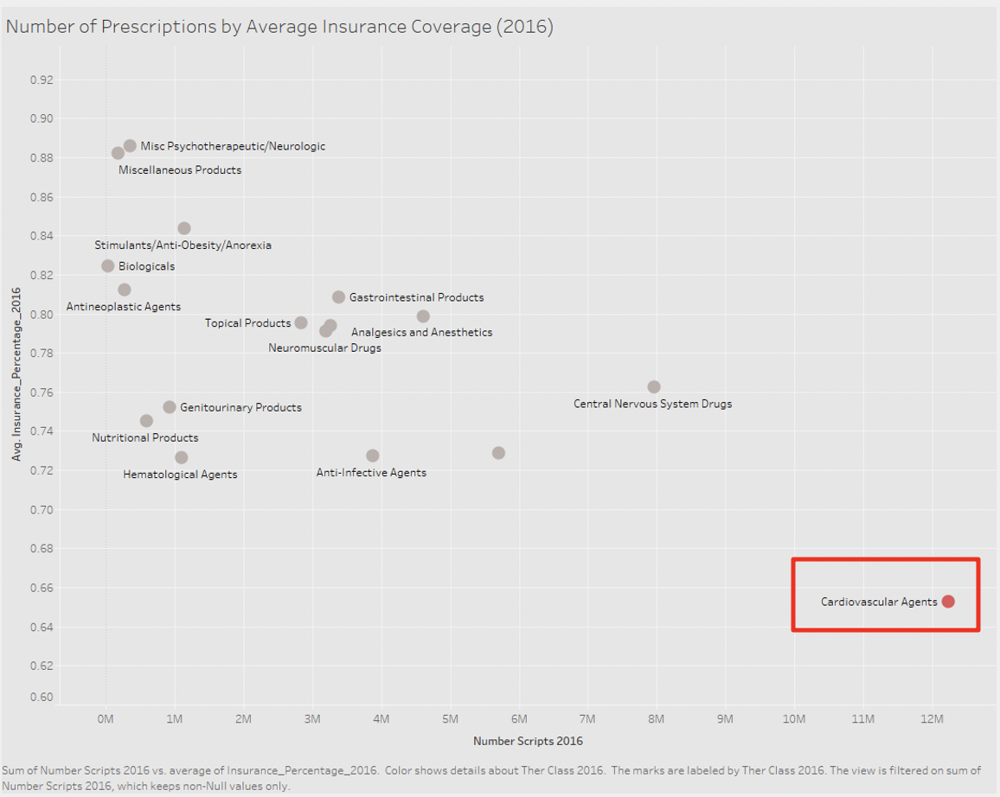

# Interdisciplinary Health Data Competition

## Introduction 
I partnered with 2 PHD students from Medical School and two classmates from my MSBA program at University of Minnesota to participate [the First Interdisciplinary Health Data Competition](https://carlsonschool.umn.edu/health-data-competition) in 2020. The goal of the competition was to promote interdisciplinary dialogue around real-world healthcare challenges and for students to provide innovative solutions using data science tools and methodologies. Our team completed an exploratory analysis of newly released prescription drug use and cost data from the Minnesota Department of Health’s Minnesota All Payer Claims Database. 

## Related files

The code for data cleaning can be found [here](https://github.com/peterwei425/Interdisciplinary-Health-Data-Competition/blob/master/Date_Cleaning.ipynb). The R code for performing data analysis can be found [here](https://github.com/peterwei425/Interdisciplinary-Health-Data-Competition/blob/master/Prescription_EDA.R). The final presentation can be found [here](https://github.com/peterwei425/Interdisciplinary-Health-Data-Competition/blob/master/Final%20Presentation.pptx). 

## Datasets

The Heath Data Competition dataset is provided by the Minnesota Department of Health's Minnesota All Payer Claims Database, a data system authorized by the legislature for health policy development in Minnesota.  The healthcare claims data is from medical providers' billing records sent to insurance companies, plan administrators and public payers.  Data for drug details can be found [here](https://github.com/peterwei425/Interdisciplinary-Health-Data-Competition/blob/master/Data/DrugDetailMerged.xlsx). Data for drug summary can be found [here](https://github.com/peterwei425/Interdisciplinary-Health-Data-Competition/blob/master/Data/SummaryMerged.xlsx). To learn more about the MN All Payer Claims Database, visit their [website](https://www.health.state.mn.us/data/apcd/index.html).

## Project Overview 

Through exploratory data analysis, our team discovered the disparity between high occurrence of cardiovascular disease and its low insurance coverage in both 2012 and 2016. There were there were approximately 12 million prescriptions for cardiovascular disease agents far and above the most prescribed compared to other therapeutic classes, but also the least covered. This is illustrated in the graph below showing coverage vs prescriptions where cardiovascular disease agents stand alone. 

We then provided policy recommendations which potentially bring $14.2M net savings for the Minnesota Government though a cost-benefit analysis. 

Team: Ben Byun, [Boyang Wei](https://github.com/peterwei425), [Lauren Moore](https://www.linkedin.com/in/lnmoore/), Paul Cho, [William Wu](https://www.linkedin.com/in/william-wu43/?miniProfileUrn=urn%3Ali%3Afs_miniProfile%3AACoAACLTc4oBtAplB1-b21CvsiaU0KFQ3M_Xuyg). 

